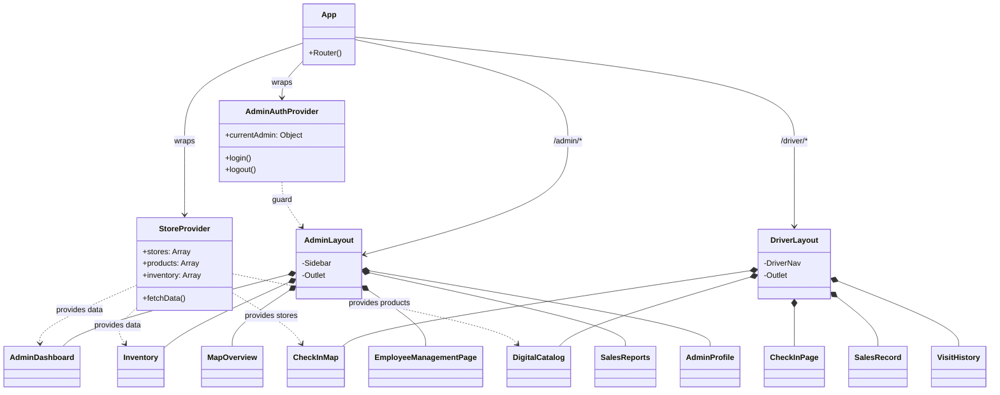
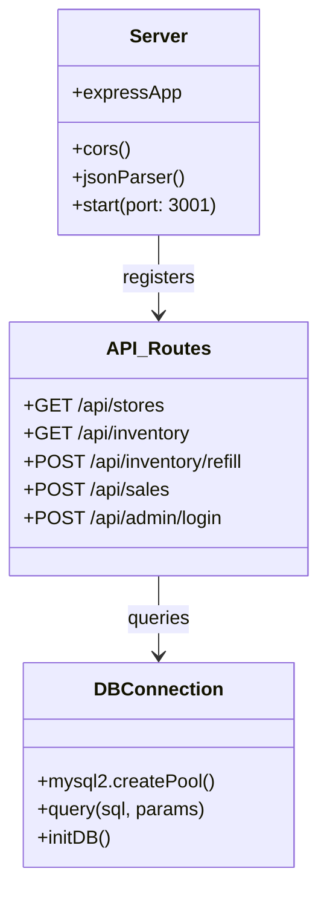

# โครงสร้างคลาสและคอมโพเนนต์ (Class Diagram / Component Architecture)

ระบบ Wae Jer Logistic ถูกพัฒนาด้วย React (Functional Components) ดังนั้นเอกสารนี้จะแสดงความสัมพันธ์ในรูปแบบของ **Component Hierarchy & Context Flow** แทน Class Diagram แบบดั้งเดิม

---

## 1. Component Architecture (Frontend)

โครงสร้างการเรียกใช้งาน Components จะแบ่งออกเป็นฝั่งพนักงาน (Driver) และฝั่งผู้ดูแล (Admin) โดยมี `Context API` คอยจัดการสถานะส่วนกลาง

---

## 2. StoreContext (State Management)
`StoreContext` เป็นหัวใจหลักในการดึงข้อมูลจาก Backend (REST API) มาเก็บไว้ใน Client State เพื่อให้แอปพลิเคชันทำงานได้รวดเร็วและเป็น Single Source of Truth

**ข้อมูลที่มีใน Context:**
- `stores`: พิกัดและสถานะร้านค้าทั้งหมด
- `categories` & `products`: ข้อมูลสินค้าที่แสดงใน Catalog
- `inventory`: สต็อกสินค้าแยกตาม Location (Master / Van)
- `drivers` & `vehicles`: ข้อมูลทรัพยากรบุคคลและรถ

**ฟังก์ชันหลัก:**
- `updateStoreStatus()`: ส่ง API ไปอัปเดตสถานะการเข้าเยี่ยมร้าน
- `updateInventory()`: สั่ง Refill สต็อกหรือตัดสต็อกเมื่อเกิดการขาย
- `refreshData()`: ดึงข้อมูลล่าสุดจาก Backend ทั้งหมด
- `checkout()`: สร้าง Order การขายใหม่

---

## 3. สถาปัตยกรรม Backend (Node.js + Express)

Backend เขียนแบบ Procedural + Functional ภายใน `server/index.ts` โดยเชื่อมต่อกับ `server/db.ts`

- **`server/db.ts`**: จัดการ Schema Initialization, Seeding ข้อมูลเบื้องต้น (เช่น สร้างตาราง, เพิ่มบัญชี Admin เริ่มต้น)
- **`server/index.ts`**: รวบรวม REST API Endpoints ทั้งหมดไว้ในไฟล์เดียว เพื่อการทำงานแบบ Lightweight Backend
