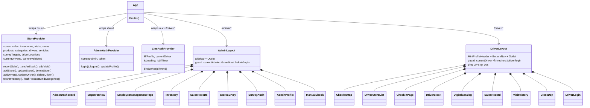
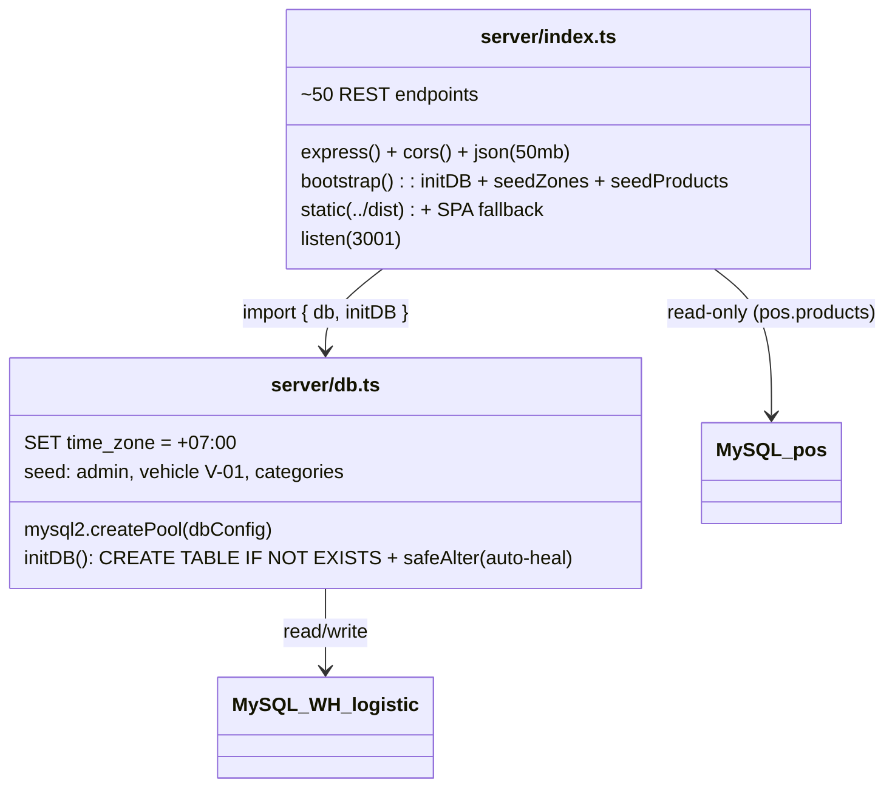

# โครงสร้างคลาสและคอมโพเนนต์ (Component Architecture)

ระบบพัฒนาด้วย React 19 (Functional Components + Hooks) เอกสารนี้จึงอธิบายในรูปแบบ **Component Hierarchy & Context Flow**

---

## 1. Provider & Routing Structure (`src/App.tsx`)

### เส้นทาง (Routes)

| ฝั่ง | Path | Component | หมายเหตุ |
| :--- | :--- | :--- | :--- |
| Driver | `/driver` (index) | CheckInMap | หน้าแรก + GPS trail |
| Driver | `/driver/login` | DriverLogin | เลือก/ผูกบัญชีพนักงาน |
| Driver | `/driver/check-in` | CheckInPage | สำรวจ + ขาย (807 บรรทัด) |
| Driver | `/driver/stores` | DriverStoreList | รายการร้าน กรองอำเภอ/ตำบล |
| Driver | `/driver/stock` | DriverStock | สต็อกบนรถ (เลือกคันรถ) |
| Driver | `/driver/catalog` | DigitalCatalog | แคตตาล็อกสต็อกรถ |
| Driver | `/driver/sales` | SalesRecord | บันทึกการขาย |
| Driver | `/driver/history` | VisitHistory | ประวัติการเยี่ยม |
| Driver | `/driver/close-day` | CloseDay | ปิดยอด/นับสต็อก |
| Driver | `/driver/manual` | ManualEbook | คู่มือ flipbook |
| Admin | `/admin` (index) | AdminDashboard | สรุปความคืบหน้ารายอำเภอ |
| Admin | `/admin/map` | MapOverview | แผนที่ + fleet tracking (987 บรรทัด) |
| Admin | `/admin/employees` | EmployeeManagementPage | จัดการพนักงาน |
| Admin | `/admin/inventory` | Inventory | 4 แท็บ (vans/master/catalog/pos) |
| Admin | `/admin/sales` | SalesReports | รายงานยอดขาย |
| Admin | `/admin/stores` | StoreSurvey | จัดการร้าน |
| Admin | `/admin/audit` | SurveyAudit | Approve/Reject ผลสำรวจ |
| Admin | `/admin/profile` | AdminProfile | โปรไฟล์ |
| Admin | `/admin/fleet` | FleetTracking | (ยังใช้ mockData — ยังไม่สมบูรณ์) |
| Admin | `/admin/products` | → redirect `/admin/inventory` | |

---

## 2. StoreContext (`src/store/StoreContext.tsx`)

หัวใจของการดึงและจัดการข้อมูลจาก REST API เป็น Single Source of Truth ฝั่ง client

**State:** `stores, sales, inventories (Record<locationId, VanInventory[]>), visits, zones, products, categories, drivers, vehicles, surveyTargets, driverLocations, currentDriverId, currentVehicleId, isCollapsed`

**Actions หลัก:**
- `recordSale(driverId, storeId, items)` → `POST /api/sales` แล้ว refetch inventory/sales/visits
- `transferStock(locationId, items)` → `POST /api/inventory/transfer`
- `addVisit(visit)` → `POST /api/visits`
- `addStore / updateStore / deleteStore`
- `addDriver / updateDriver / deleteDriver`
- `addProduct / updateProduct / deleteProduct`
- `addSurveyTarget / deleteSurveyTarget`
- `fetchInventory(locationId)` / `updateInventory(productId, locationId, qty)`
- `closeDay()` / `returnStock(driverId)`

**Polling:** `fetchDriverLocations()` ทุก 30 วินาที (สำหรับหน้า Admin Map)
**Persistence:** `driver_id`, `vehicle_id`, `sidebar_collapsed` เก็บใน `localStorage`

---

## 3. Auth Contexts

| Context | ใช้กับ | กลไก |
| :--- | :--- | :--- |
| `AdminAuthContext` | Admin | `login()` เก็บ `admin_user` + `admin_token` ใน localStorage; `AdminLayout` เป็น guard |
| `LineAuthContext` | Driver | `liff.init()` → ถ้าไม่ล็อกอินและไม่ใช่ localhost จะ `liff.login()`; ดึง `getProfile()` แล้วเช็ค `/api/drivers/auth-line`; `bindDriver()` เรียก `/api/drivers/bind-line`; localhost ใช้ `dev_user` |

---

## 4. สถาปัตยกรรม Backend (`server/`)

- **`server/db.ts`** — สร้าง connection pool, ตั้ง timezone, `initDB()` ทำ auto-heal คอลัมน์ทีละตัว, seed ข้อมูลตั้งต้นเมื่อว่าง
- **`server/index.ts`** — endpoints ทั้งหมดในไฟล์เดียว, seed `zones` จาก `korat_zones.json` และสินค้าตัวอย่าง, เสิร์ฟ SPA ใน production

---

## 5. Utilities & Constants

| ไฟล์ | หน้าที่ |
| :--- | :--- |
| `src/utils/cloudinary.ts` | `uploadToCloudinary(file)` — อัปโหลด unsigned preset; fallback บีบอัด Base64 (800px, q60) |
| `src/constants/locations.ts` | `KORAT_SUBDISTRICTS`, `KORAT_DISTRICTS`, `findDistrictByCoords()` + import GeoJSON |
| `src/store/korat_geojson.json` | ขอบเขตอำเภอโคราชสำหรับ Leaflet GeoJSON layer |
| `src/store/mockData.ts` | ข้อมูลจำลอง (ยังใช้ใน `FleetTracking`, `CheckInPage` บางส่วน) |
| `src/components/ui/ProgressBarLoader.tsx` | หน้าจอโหลด |
