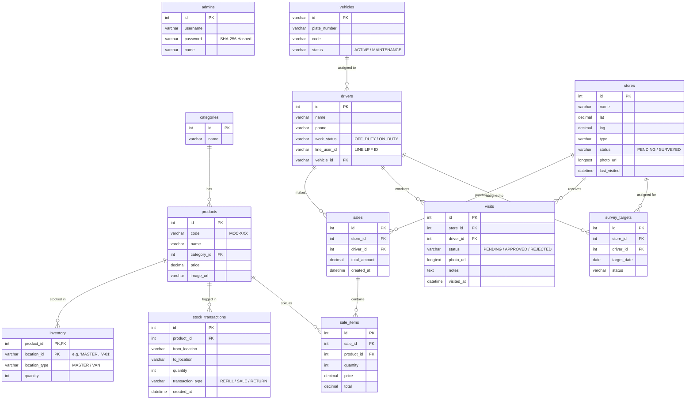

# โครงสร้างฐานข้อมูล (Entity-Relationship Diagram)

เอกสารนี้แสดงแผนผังโครงสร้างฐานข้อมูล (ER Diagram) ของระบบ Wae Jer Logistic ซึ่งถูกออกแบบมารองรับระบบสินค้าคงคลังหลายระดับ (Master/Van), การเก็บข้อมูลพนักงาน, ยานพาหนะ, ข้อมูลร้านค้า และการบันทึกการขาย

---

## 1. ER Diagram

---

## 2. คำอธิบายตารางหลัก

- **admins**: เก็บข้อมูลผู้ดูแลระบบและรหัสผ่านที่เข้ารหัสเพื่อความปลอดภัย
- **products & categories**: ข้อมูลสินค้าและหมวดหมู่ (อ้างอิงจากรหัส MOC)
- **inventory**: ตารางสำคัญที่สุดที่ทำหน้าที่แยกสต็อก โดยใช้ `location_id` เป็นตัวแยกว่าเป็น 'MASTER' หรือเป็น ID ของรถ ('V-01', 'V-02') `location_type` จะระบุว่าเป็น 'MASTER' หรือ 'VAN'
- **stores & visits**: `stores` เก็บข้อมูลพิกัดและรายละเอียดร้านค้า ส่วน `visits` จะเก็บข้อมูล Log ว่าใครเข้าไปเยี่ยมร้านนี้เมื่อไหร่ และอัปโหลดภาพอะไรบ้าง
- **sales & sale_items**: จัดเก็บข้อมูลบิลขายและรายละเอียดรายการสินค้าที่ขายออกไปในแต่ละบิล
- **drivers & vehicles**: จับคู่พนักงานขับรถกับยานพาหนะ โดยเชื่อม `line_user_id` เข้ากับระบบ LIFF
