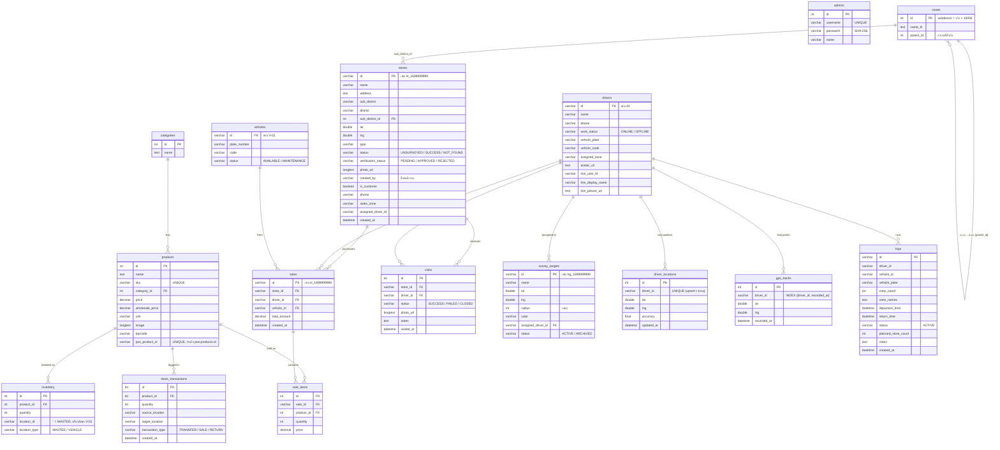

# โครงสร้างฐานข้อมูล (Entity-Relationship Diagram)

เอกสารนี้แสดงโครงสร้างฐานข้อมูล MySQL (`WH_logistic`) ของระบบ Wae Jer Logistic ตามที่นิยามใน `server/db.ts` และใช้งานจริงใน `server/index.ts`

> ระบบยังอ่านข้อมูลจากฐานข้อมูล **`pos`** (ระบบ line-commerce) บนเซิร์ฟเวอร์ MySQL เดียวกัน โดยเฉพาะตาราง `pos.products` — เป็นการอ่านอย่างเดียว ไม่มี Foreign Key ข้ามฐานข้อมูล

---

## 1. ER Diagram

---

## 2. หมายเหตุการออกแบบที่สำคัญ

- **Primary Key เป็น VARCHAR** สำหรับ `stores` (`st_<timestamp>`), `sales` (`sl_<timestamp>`), `drivers` (`d1`, ...), `vehicles` (`V-01`), `survey_targets` (`trg_<timestamp>`) — สร้างจากฝั่งแอปพลิเคชัน ไม่ใช่ AUTO_INCREMENT
- **`inventory` ไม่มี composite key** — ใช้ `id` AUTO_INCREMENT และค้นด้วยคู่ (`product_id`, `location_id`); MASTER คือ `location_type = 'MASTER'` และ `location_id = ''`
- **`zones`** เก็บทั้งอำเภอและตำบลในตารางเดียว: ตำบลใช้ `id` = ค่าจริง + 10000 และ `parent_id` ชี้ไปที่อำเภอ (seed จาก `korat_zones.json`)
- **สถานะร้าน 2 มิติ:** `stores.status` (ความคืบหน้าการเยี่ยม) แยกจาก `stores.verification_status` (ผลการตรวจสอบโดยแอดมิน)
- **`sale_items` ไม่มีคอลัมน์ `total`** — คำนวณ `quantity * price` ตอนแสดงผล
- **`pos_product_id`** เชื่อม `products` กับ `pos.products` แบบ logical (มี UNIQUE index) ใช้ตอน sync แคตตาล็อก
- **การลบร้าน** เป็น cascade ที่ระดับแอปพลิเคชัน (ลบ `sale_items` → `sales` → `visits` → `stores`)
- ตาราง `trips` มีอยู่ในสคีมาเพื่อรองรับฟีเจอร์บันทึกรอบเดินรถ/ทีมงาน แต่ยังไม่มี API endpoint ใช้งานเต็มรูปแบบในปัจจุบัน
