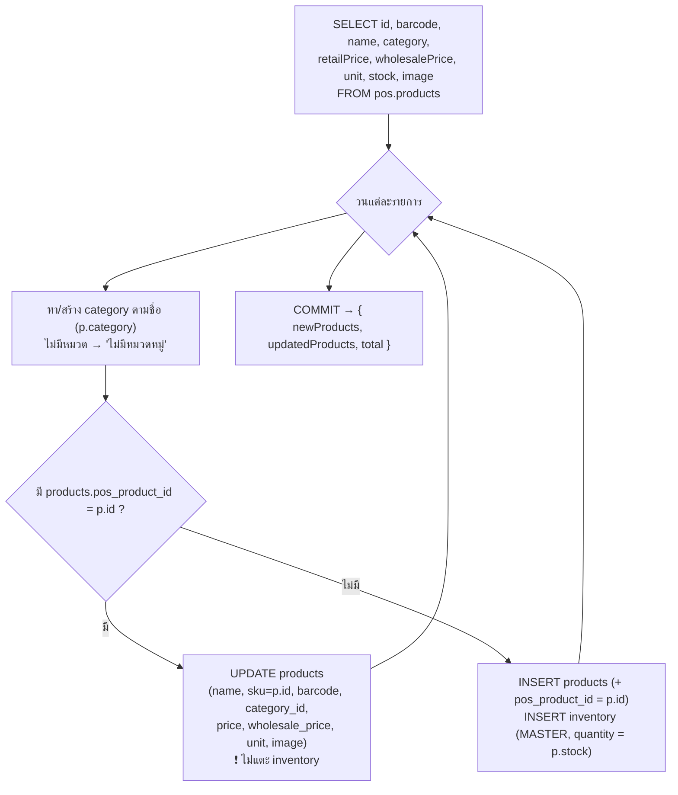

# การเชื่อมต่อระบบ POS (line-commerce)

ระบบ Wae Jer Logistic เชื่อมกับระบบ POS ของ **line-commerce** โดยตรงที่ระดับฐานข้อมูล — MySQL เซิร์ฟเวอร์เดียวกัน คนละ database (`WH_logistic` ↔ `pos`) การเชื่อมต่อเป็น **อ่านอย่างเดียว (one-way, read-only)**

---

## 1. เหตุผลและขอบเขต

- ระบบ POS มีแคตตาล็อกสินค้าจริงที่ใช้หน้าร้าน (ชื่อ, บาร์โค้ด, ราคาปลีก/ส่ง, หน่วย, สต็อก, รูป)
- Cashvan ต้องการใช้แคตตาล็อกชุดเดียวกันเป็น **คลังสินค้าหลัก (Master Warehouse)** สำหรับโหลดขึ้นรถ
- Cashvan **ไม่เขียน**ข้อมูลกลับไปที่ `pos` — เมื่อ Cashvan เริ่มโหลดของขึ้นรถ สต็อกจะถูกติดตามแยกในตาราง `inventory` ของ `WH_logistic` เอง

---

## 2. ตารางต้นทาง: `pos.products`

ฟิลด์ที่ใช้: `id`, `barcode`, `name`, `category`, `retailPrice`, `wholesalePrice`, `unit`, `stock`, `image`

---

## 3. โหมดการใช้งาน 2 แบบ

### 3.1 อ้างอิงแบบอ่านอย่างเดียว — `GET /api/pos-products`
- แสดงในแท็บ **"อ้างอิง POS"** ของหน้า Inventory
- รองรับ `search` (ค้นตาม `name` / `barcode`), `limit` (≤ 200, default 50), `offset` (แบ่งหน้า)
- คืน `{ items, total }` — ไม่ผ่าน StoreContext (fetch ตรงในหน้า)
- ใช้เพื่อ "เทียบ" ว่าสต็อกจริงหน้าร้านเป็นอย่างไร

### 3.2 นำเข้าเป็นแคตตาล็อกหลัก — `POST /api/products/sync-from-pos`



**คุณสมบัติสำคัญ:**
- ทำงานในทรานแซกชันเดียว (commit/rollback)
- **ปลอดภัยเมื่อรันซ้ำ (idempotent)** — จับคู่ด้วย `pos_product_id`
- สินค้าที่เคยนำเข้าแล้ว: อัปเดตเฉพาะข้อมูลแคตตาล็อก **ไม่แก้จำนวนสต็อก MASTER** (เพราะ Cashvan ติดตามสต็อกเองหลังเริ่มโหลดขึ้นรถ)
- สินค้าใหม่: เพิ่มพร้อมตั้งสต็อก MASTER = `stock` จาก POS
- `products.sku` จะถูกตั้งเป็นค่า `pos.products.id`

---

## 4. สคีมาที่รองรับ (patch ใน `server/db.ts`)

```sql
ALTER TABLE products ADD COLUMN wholesale_price DECIMAL(10,2) DEFAULT 0;
ALTER TABLE products ADD COLUMN unit           VARCHAR(20) DEFAULT 'ชิ้น';
ALTER TABLE products ADD COLUMN image          LONGTEXT;
ALTER TABLE products ADD COLUMN barcode        VARCHAR(100);
ALTER TABLE products ADD COLUMN pos_product_id VARCHAR(50);
ALTER TABLE products ADD UNIQUE INDEX idx_pos_product_id (pos_product_id);
```

---

## 5. ข้อกำหนดสิทธิ์ (Permissions)

บัญชี MySQL ที่ backend ใช้ต้องมีสิทธิ์:
- `SELECT, INSERT, UPDATE, DELETE` บน `WH_logistic.*`
- `SELECT` บน `pos.products` (อย่างน้อย)

---

## 6. ข้อจำกัด / แนวทางต่อยอด

- ไม่มีการ sync แบบอัตโนมัติ/ตามเวลา — ต้องกดปุ่มนำเข้าเอง
- ไม่ sync การลบ — สินค้าที่ถูกลบใน POS จะยังคงอยู่ใน Cashvan
- ราคาที่นำเข้าใช้ `retailPrice` เป็น `price` หลัก; ยังไม่มี logic เลือกใช้ราคาส่งอัตโนมัติตามลูกค้า
- อาจพิจารณาทำ view หรือ stored procedure ฝั่ง DB เพื่อลดการ query ข้ามฐานข้อมูลจาก Node
