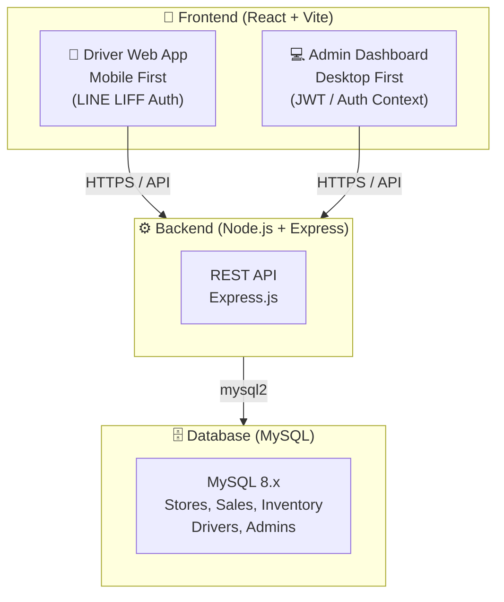

# บทนำและภาพรวมโครงการ
## ระบบ Wae Jer Logistic (Cashvan & Survey Management)

**ชื่อโครงการ:** Wae Jer Logistic (Cashvan & Survey Management)  
**วันที่จัดทำ:** 29 เมษายน 2569  

---

## 1. ความเป็นมาและแรงจูงใจ

ระบบ Wae Jer Logistic ถูกพัฒนาขึ้นเพื่อใช้เป็นระบบบริหารจัดการทีมขายหน่วยรถ (Cashvan) และการลงพื้นที่สำรวจร้านค้า (Store Survey) สำหรับบริษัทที่ต้องมีการนำรถวิ่งเข้าหาลูกค้าหรือร้านค้าย่อยในพื้นที่ต่างๆ เพื่อกระจายสินค้า ตรวจสอบสต็อก และรับออเดอร์โดยตรง

เดิมทีพนักงานขับรถหรือหน่วยขายต้องจดบันทึกการขายและจำนวนสต็อกด้วยกระดาษ ทำให้ตรวจสอบยอดได้ยากและเกิดความผิดพลาดบ่อยครั้ง ระบบนี้จึงเข้ามาจัดการตั้งแต่การ **Check-in ของพนักงาน**, **พิกัดร้านค้า**, **การสต็อกสินค้าบนรถ (Van Stock)**, และ **บันทึกการขายประจำวัน** พร้อมกับเชื่อมข้อมูลเข้าสู่ส่วนกลางแบบ Real-time เพื่อให้แอดมินหรือผู้จัดการติดตามได้

---

## 2. วัตถุประสงค์ของโครงการ

1. **Digital Transformation สำหรับ Cashvan**: เปลี่ยนการจดบันทึกบนกระดาษมาเป็นการทำธุรกรรมผ่านระบบทั้งหมด
2. **Real-time Fleet Tracking**: แอดมินสามารถดูแผนที่เพื่อติดตามพนักงานขับรถว่าอยู่จุดใด หรือกำลังเข้าเยี่ยมร้านค้าไหนได้แบบทันที
3. **Inventory Management**: จัดการสต็อกสินค้าทั้งในคลังหลัก (Master) และสต็อกย่อยบนรถ (Van) ให้ถูกต้องแม่นยำ
4. **Sales & Survey Recording**: บันทึกการขายสินค้าและการทำแบบสอบถามหรือสำรวจข้อมูลร้านค้าแต่ละพื้นที่
5. **Security & Authentication**: ป้องกันการเข้าถึงด้วยระบบ Admin Authentication (สำหรับผู้ดูแล) และ LINE LIFF (สำหรับยืนยันตัวตนพนักงานขับรถ)

---

## 3. ภาพรวมระบบ (System Overview)

### 3.1 สถาปัตยกรรมระบบ

ระบบถูกออกแบบเป็น **Full-Stack Web Application** ที่มีสถาปัตยกรรมแบบ Client-Server แยกตามบทบาทของผู้ใช้งาน:



### 3.2 ผู้ใช้งานของระบบ (Users)

| กลุ่มผู้ใช้ | หน้าที่หลัก | ช่องทางการเข้าถึง |
| :--- | :--- | :--- |
| **Driver / พนักงานขับรถ** | Check-in เวลาเริ่มงาน/เยี่ยมร้าน, สำรวจร้านค้า, จัดการสต็อกบนรถ, บันทึกการขาย, ดูประวัติการขาย, ปิดยอดวัน | Web App (Mobile Browser / LINE LIFF) |
| **Admin / ผู้จัดการ** | ดู Dashboard ยอดขาย, ติดตามพิกัดรถในแผนที่, อนุมัติข้อมูลร้านค้า, จัดการพนักงาน, เบิกจ่ายสต็อก (Refill), จัดการรายการสินค้า | Web App (Desktop Browser) |

### 3.3 ฟีเจอร์หลักของระบบ

```
Wae Jer Logistic
│
├── 🚚 ระบบ Driver (Mobile)
│   ├── Check-in เริ่มวันทำงาน และยืนยันพิกัด (GPS)
│   ├── แผนที่ร้านค้า (CheckInMap)
│   ├── ข้อมูลและการสำรวจร้านค้า (CheckInPage)
│   ├── แคตตาล็อกสินค้าดิจิทัล (Digital Catalog)
│   ├── บันทึกการขาย (Sales Record)
│   ├── ดูประวัติการเข้าเยี่ยมร้าน (Visit History)
│   └── สรุปยอดและปิดกะ (Close Day)
│
└── 💻 ระบบ Admin (Desktop)
    ├── Dashboard — ภาพรวมยอดขาย, จำนวนร้านค้า
    ├── Map Overview — แผนที่ระบุตำแหน่งร้านค้าและพนักงาน
    ├── จัดการพนักงาน (Employee Management)
    ├── คลังสินค้า (Inventory) — สต็อกหลัก & Van Refill
    ├── รายงานยอดขาย (Sales Reports)
    ├── จัดการสินค้า (Product Management)
    ├── ตรวจสอบแบบสำรวจ (Survey Audit)
    └── โปรไฟล์ผู้ดูแล (Admin Profile)
```

---

## 4. เทคโนโลยีที่ใช้พัฒนา

| ชั้นระบบ | เทคโนโลยี |
| :--- | :--- |
| **Frontend** | React 19, Vite, TypeScript, Tailwind CSS |
| **Mapping** | Leaflet, React-Leaflet |
| **Backend** | Node.js, Express.js |
| **Database** | MySQL (ใช้ `mysql2`) |
| **Authentication** | LINE LIFF (Driver), Local/Context Auth + SHA256 (Admin) |

---

## 5. กระบวนการทำงานหลัก (Key Workflow)

**กระบวนการ Cashvan (หน่วยรถ)**
1. **เตรียมความพร้อม**: แอดมินทำการย้ายสต็อกสินค้าจากคลังหลัก เข้าสู่รถคันต่างๆ (Van Refill)
2. **ลงพื้นที่**: พนักงานขับรถเปิดระบบ (ยืนยันตัวตนผ่าน LINE LIFF) และทำการ Check-in เริ่มวันทำงาน
3. **เยี่ยมร้านค้า**: พนักงานดูแผนที่ร้านค้า เข้าเยี่ยมร้าน ถ่ายรูปยืนยัน และทำแบบสำรวจร้านค้า
4. **เสนอขายสินค้า**: พนักงานเปิด Digital Catalog บันทึกออเดอร์ และตัดสต็อกสินค้าในรถทันที
5. **ปิดกะ**: เมื่อวิ่งครบทุกร้าน พนักงานสรุปยอดรายวันและกดยืนยันเพื่อปิดกะการทำงาน

---

*เอกสารนี้จัดทำเพื่อสรุปและให้ภาพรวมของโครงการ Wae Jer Logistic*
