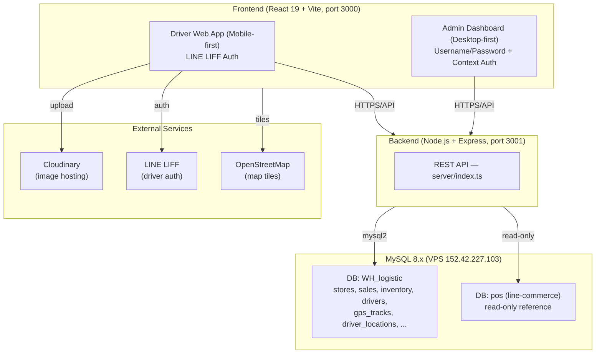

# บทนำและภาพรวมโครงการ
## ระบบ Wae Jer Logistic (Cashvan & Survey Management)

**ชื่อโครงการ:** Wae Jer Logistic (Cashvan & Survey Management)
**เวอร์ชัน:** 1.2.0
**วันที่จัดทำเอกสารฉบับแรก:** 29 เมษายน 2569
**วันที่ปรับปรุงล่าสุด:** 2 กันยายน 2569

---

## 1. ความเป็นมาและแรงจูงใจ

ระบบ Wae Jer Logistic ถูกพัฒนาขึ้นเพื่อใช้เป็นระบบบริหารจัดการทีมขายหน่วยรถ (Cashvan) และการลงพื้นที่สำรวจร้านค้า (Store Survey) สำหรับบริษัทที่ต้องนำรถวิ่งเข้าหาร้านค้าย่อยในพื้นที่จังหวัดนครราชสีมา (โคราช) เพื่อกระจายสินค้า ตรวจสอบสต็อก และรับออเดอร์โดยตรง

เดิมทีพนักงานขับรถหรือหน่วยขายต้องจดบันทึกการขายและจำนวนสต็อกด้วยกระดาษ ทำให้ตรวจสอบยอดได้ยากและเกิดความผิดพลาดบ่อยครั้ง ระบบนี้จึงเข้ามาจัดการตั้งแต่การ **ยืนยันตัวตนผ่าน LINE**, **ติดตามพิกัด GPS ของพนักงานแบบเรียลไทม์**, **พิกัดและข้อมูลร้านค้ารายตำบล/อำเภอ**, **การจัดสต็อกสินค้าบนรถ (Van Stock)** และ **บันทึกการขายประจำวัน** พร้อมเชื่อมข้อมูลเข้าสู่ส่วนกลางแบบเรียลไทม์เพื่อให้แอดมินหรือผู้จัดการติดตามได้

ในเฟสล่าสุด ระบบยังเชื่อมกับ **ระบบ POS ของ line-commerce** (ฐานข้อมูล `pos` บนเซิร์ฟเวอร์ MySQL เดียวกัน) เพื่อดึงแคตตาล็อกสินค้าจริงมาเป็นคลังสินค้าหลัก (Master Warehouse) ของ Cashvan

---

## 2. วัตถุประสงค์ของโครงการ

1. **Digital Transformation สำหรับ Cashvan** — เปลี่ยนการจดบันทึกบนกระดาษมาเป็นการทำธุรกรรมผ่านระบบทั้งหมด
2. **Real-time Fleet Tracking** — แอดมินดูแผนที่เพื่อติดตามตำแหน่งพนักงานขับรถแบบเรียลไทม์ พร้อมเส้นทางการเดินทางย้อนหลังรายวัน (GPS Trail)
3. **Inventory Management** — จัดการสต็อกทั้งในคลังหลัก (Master) และสต็อกย่อยบนรถแต่ละคัน (Van) ให้ถูกต้องแม่นยำ พร้อมบันทึกประวัติการโอนย้าย (Stock Transactions)
4. **Sales & Survey Recording** — บันทึกการขายและผลสำรวจสภาพร้านค้าพร้อมรูปถ่าย โดยจัดเก็บรูปบน Cloudinary
5. **Territory Management** — แบ่งพื้นที่รับผิดชอบตามขอบเขตอำเภอ/ตำบลของโคราช และกำหนดเป้าหมายสำรวจ (Survey Targets / Geofence)
6. **POS Integration** — ดึงแคตตาล็อกสินค้าจริงจากระบบ POS (line-commerce) มาใช้เป็นคลังสินค้าหลัก
7. **Security & Authentication** — Admin ล็อกอินด้วย Username/Password (SHA-256) ส่วน Driver ยืนยันตัวตนผ่าน LINE LIFF แล้วผูก (bind) กับรายชื่อพนักงาน

---

## 3. ภาพรวมระบบ (System Overview)

### 3.1 สถาปัตยกรรมระบบ

ระบบเป็น **Full-Stack Web Application** สถาปัตยกรรม Client-Server แยกตามบทบาทผู้ใช้



### 3.2 ผู้ใช้งานของระบบ (Users)

| กลุ่มผู้ใช้ | หน้าที่หลัก | ช่องทางการเข้าถึง |
| :--- | :--- | :--- |
| **Driver / พนักงานขับรถ** | ยืนยันตัวตนผ่าน LINE, ส่งพิกัด GPS อัตโนมัติ, ดูแผนที่ร้านค้า, เช็คอิน/สำรวจร้าน, เพิ่มร้านใหม่, ดูสต็อกบนรถ, บันทึกการขาย, ดูประวัติการเยี่ยม, ปิดยอด/นับสต็อกปลายวัน | Mobile Web (LINE in-app browser / LIFF) |
| **Admin / ผู้จัดการ** | Dashboard สรุปยอด, ติดตามรถบนแผนที่ (Fleet Tracking), นำเข้า/จัดการสินค้า, โอนสต็อกขึ้นรถ, จัดการพนักงาน, ตรวจสอบผลสำรวจ (Approve/Reject), รายงานยอดขายและเปรียบเทียบพนักงาน | Desktop Web Browser |

### 3.3 ฟีเจอร์หลักของระบบ

```
Wae Jer Logistic
│
├── ระบบ Driver (Mobile Web)
│   ├── ยืนยันตัวตน LINE LIFF + ผูกบัญชีพนักงาน (bind)
│   ├── ส่งพิกัด GPS อัตโนมัติทุก 30 วินาที + บันทึกเส้นทาง (GPS Trail)
│   ├── แผนที่ร้านค้า (CheckInMap) — แสดงหมุดร้าน + geofence เป้าหมายสำรวจ
│   ├── รายการร้านค้า (DriverStoreList) — กรองตามอำเภอ/ตำบล, แท็บ ยังไม่ไป / เสร็จแล้ว
│   ├── เช็คอิน + สำรวจร้าน (CheckInPage) — ตรวจระยะ GPS, ถ่ายรูปขึ้น Cloudinary, เพิ่มร้านใหม่
│   ├── สต็อกบนรถ (DriverStock / DigitalCatalog)
│   ├── บันทึกการขาย (SalesRecord) — ตัดสต็อกรถอัตโนมัติ
│   ├── ประวัติการเยี่ยมร้าน (VisitHistory)
│   ├── ปิดยอด/นับสต็อก (CloseDay) — เทียบยอดคาดหวังกับยอดจริง
│   └── คู่มือการใช้งาน (ManualEbook — flipbook)
│
└── ระบบ Admin (Desktop Web)
    ├── หน้าแรก / Dashboard — สรุปความคืบหน้าการสำรวจรายอำเภอ (ตัวกรอง วันนี้/สัปดาห์/เดือน)
    ├── Map Overview — Leaflet + ขอบเขต GeoJSON โคราช, หมุดร้านตามสถานะ, geofence,
    │                  ตำแหน่งรถเรียลไทม์, เส้นทาง GPS ย้อนหลัง, ปุ่มขอเส้นทางนำทาง
    ├── จัดการพนักงาน (EmployeeManagementPage)
    ├── คลังสินค้าและสินค้า (Inventory) — 4 แท็บ: สต็อกรถ / คลังหลัก / แคตตาล็อก / อ้างอิง POS
    ├── รายงานยอดขาย (SalesReports) — รายบิล, เปรียบเทียบผลงานพนักงาน
    ├── ร้านค้าและผลสำรวจ (StoreSurvey) + ตรวจสอบผลสำรวจ (SurveyAudit — Approve/Reject)
    └── โปรไฟล์ผู้ดูแล (AdminProfile)
```

---

## 4. เทคโนโลยีที่ใช้พัฒนา

| ชั้นระบบ | เทคโนโลยี |
| :--- | :--- |
| **Frontend** | React 19, Vite 6, TypeScript, Tailwind CSS 4 |
| **Routing / State** | React Router DOM 7, React Context API |
| **Mapping** | Leaflet 1.9 + React-Leaflet 5, OpenStreetMap tiles, GeoJSON ขอบเขตอำเภอโคราช |
| **Charts / UI** | Recharts, lucide-react, motion (framer-motion), react-pageflip (คู่มือ e-book) |
| **Backend** | Node.js, Express 4 (รันด้วย `tsx`) |
| **Database** | MySQL 8.x ผ่าน `mysql2/promise` (connection pool) |
| **Auth** | LINE LIFF (`@line/liff`) สำหรับ Driver, SHA-256 + Context/localStorage สำหรับ Admin |
| **Image Hosting** | Cloudinary (unsigned upload preset) + fallback บีบอัดเป็น Base64 |
| **External Data** | ฐานข้อมูล `pos` ของระบบ line-commerce (อ่านอย่างเดียว) |

> หมายเหตุ: แพ็กเกจ `@react-google-maps/api` และ `@google/genai` ถูกติดตั้งไว้ในโปรเจกต์ แต่โค้ดที่ใช้งานจริงในปัจจุบันใช้ Leaflet/OpenStreetMap เป็นหลัก

---

## 5. กระบวนการทำงานหลัก (Key Workflow)

1. **เตรียมสินค้า** — Admin นำเข้าแคตตาล็อกจาก POS (ครั้งแรก) จากนั้นโอนสต็อกจากคลังหลักขึ้นรถแต่ละคัน (Van Transfer)
2. **เริ่มงาน** — Driver เปิดแอปผ่าน LINE, ระบบยืนยันตัวตนและเริ่มส่งพิกัด GPS อัตโนมัติ
3. **ลงพื้นที่** — Driver ดูแผนที่/รายการร้าน เดินทางไปร้าน ตรวจระยะ GPS แล้วเช็คอิน ถ่ายรูปหน้าร้าน เลือกสถานะร้าน (สำเร็จ/ปิด/ไม่พบ) หรือเพิ่มร้านใหม่
4. **ขายสินค้า** — Driver เปิดแคตตาล็อกสต็อกบนรถ บันทึกออเดอร์ ระบบตัดสต็อกรถและอัปเดตสถานะร้านเป็น SUCCESS ทันที
5. **ปิดกะ** — Driver นับสต็อกจริงเทียบกับยอดคาดหวัง (CloseDay) แล้วส่งเงิน/สลิปให้แอดมิน
6. **ตรวจสอบ** — Admin ตรวจสอบผลสำรวจ (Approve/Reject), ดูรายงานยอดขายและกระทบยอด

---

*เอกสารนี้จัดทำเพื่อสรุปและให้ภาพรวมของโครงการ Wae Jer Logistic — ปรับปรุงให้ตรงกับซอร์สโค้ดปัจจุบัน*
