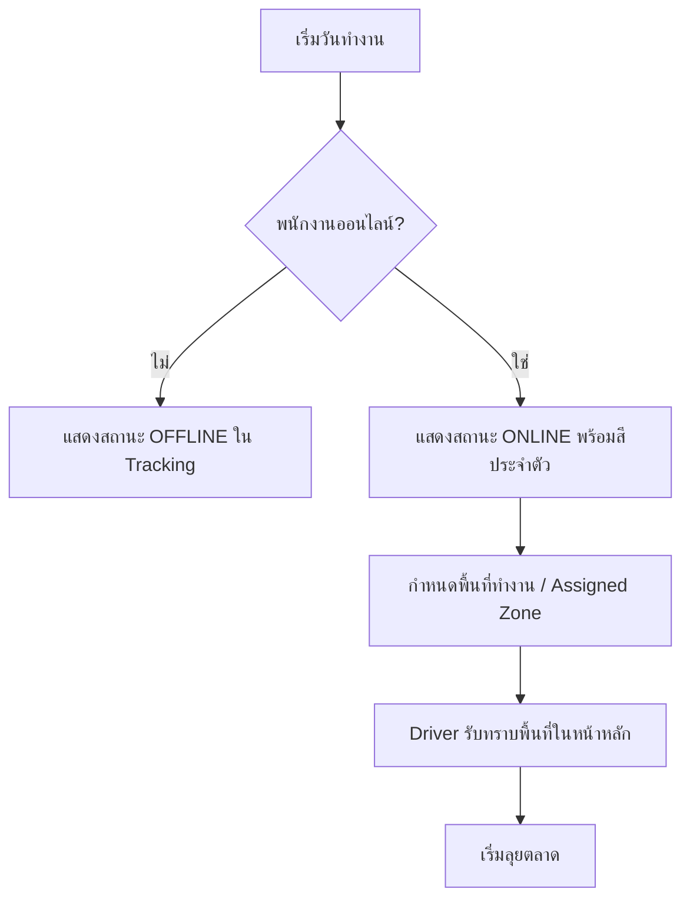
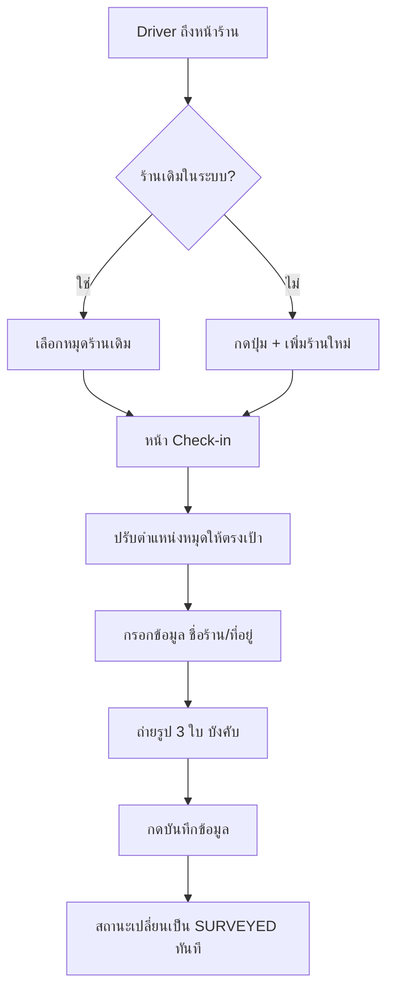

# ระบบ Cashvan & Survey Management - Workflow Documentation

เอกสารนี้บรรยายขั้นตอนการทำงาน (Flow) ของฟีเจอร์หลักในระบบ เพื่อให้เห็นภาพรวมการทำงานระหว่าง Admin และ Driver

---

## 1. การจัดการทีมและสถานะงาน (Daily Work Dashboard)
ฟีเจอร์สำหรับ Admin ในการควบคุมภาพรวมประจำวัน

**ขั้นตอนการทำงาน:**
1. **Status Monitoring:** Admin เข้าหน้า Fleet Tracking เพื่อดูลูกบอลสี (Green/Grey) แทนสถานะพนักงาน
2. **Territory Sync:** Admin ระบุ Zone ที่ต้องการให้พนักงานเข้าพื้นที่ในวันนั้น (เช่น เมือง, ปากช่อง)
3. **Real-time Awareness:** ระบบเปลี่ยนจากการติดตาม GPS ตลอดเวลา มาเป็นการรายงาน "ความคืบหน้า" (Progress) ของร้านค้าที่สำรวจแล้วแทน

---

## 2. การจัดการสต็อกรถ (Van Stock Management)
กระบวนการเคลื่อนย้ายสินค้าจากคลังใหญ่ไปสู่รถแต่ละคัน

**ขั้นตอนการทำงาน:**
1. **Stock In:** Admin เข้าหน้า Inventory เลือกสินค้าและจำนวนที่ต้องการส่งมอบให้ Driver
2. **Driver Verification:** Driver เปิดเมนู **Van Stock** บนมือถือเพื่อตรวจสอบว่าสินค้าที่รับมา "ตรง" กับในระบบหรือไม่
3. **Availability:** สินค้าที่อยู่ใน Van Stock จะเป็นตัวกำหนดว่าในหน้า **Digital Catalog** ของ Driver คนนั้นจะขายอะไรได้บ้าง

---

## 3. การเช็คอินและสำรวจร้านค้า (Store Survey & Check-in)
*High-fidelity Mobile-first Workflow*

**สิ่งที่ระบบบังคับ (Validation Rules):**
- **พิกัด GPS:** ต้องระบุตำแหน่งร้านค้าที่แน่นอน
- **รูปภาพ (3 รูป):** บังคับถ่าย หน้าร้าน, ภายในร้าน, และชั้นวางสินค้า
- **สถานะ:** ร้านที่ Check-in สำเร็จจะเปลี่ยนยอดสะสมใน Dashboard ของ Admin ทันที

---

## 4. แคตตาล็อกสินค้าและการขาย (Digital Catalog & Sales)
กระบวนการนำเสนอสินค้าและบันทึกยอดขาย

---

## 5. การติดตามผลงาน (Visit History & Reports)
การตรวจสอบย้อนหลังสำหรับหน่วยงานบริหาร

*   **Visit History:** เก็บ Log ทุกครั้งที่มีการ Check-in (พร้อมรูปภาพและพิกัดแผนที่)
*   **Sales Report:** สรุปยอดขายรายวัน/รายเดือน แยกตามรายชื่อพนักงาน
*   **Survey Report:** สรุปจำนวนร้านค้าใหม่ที่ถูกเพิ่มเข้ามาในระบบโดย Driver

---
*เอกสารฉบับนี้อัปเดตล่าสุด: 21 เมษายน 2569*
