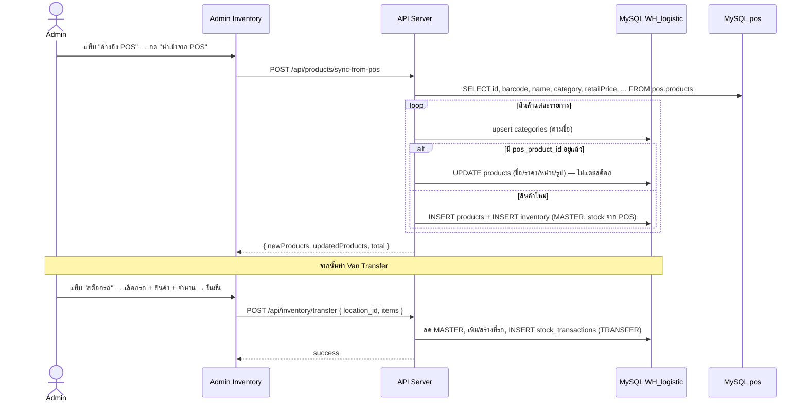
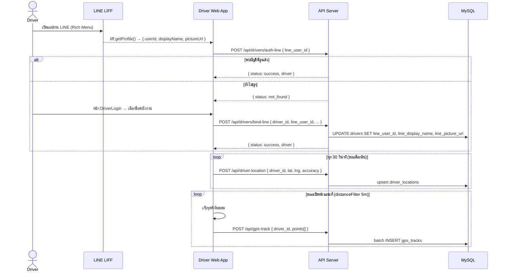
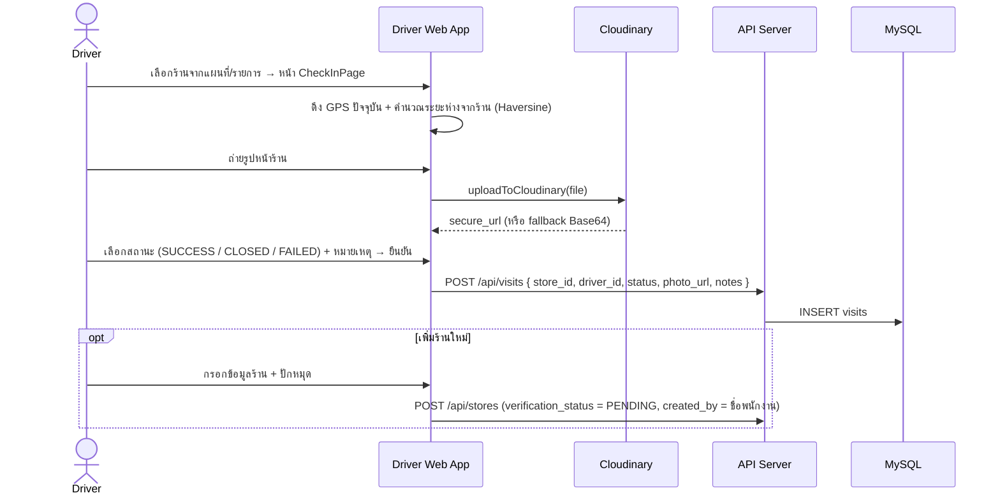
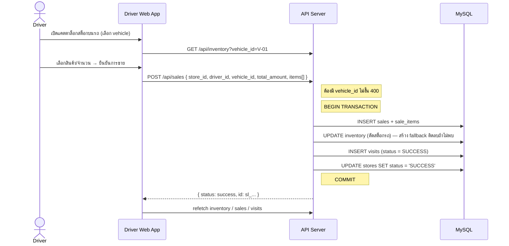
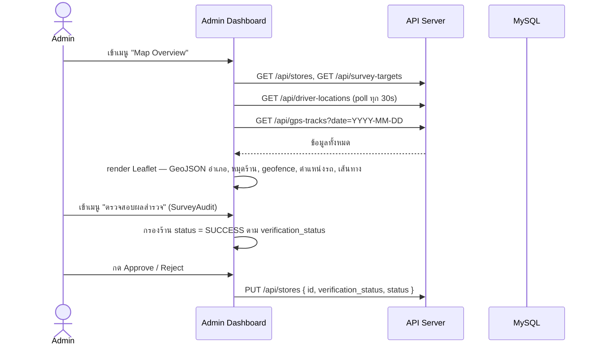
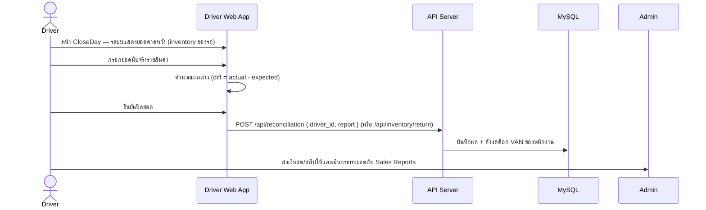

# กระบวนการทำงานของระบบ (System Workflows)

อธิบาย Flow การทำงานหลักของระบบ Wae Jer Logistic ตามการทำงานจริงของโค้ดปัจจุบัน

---

## 1. การนำเข้าแคตตาล็อกจาก POS และการโอนสต็อกขึ้นรถ

---

## 2. การเข้าระบบของพนักงานผ่าน LINE และการติดตาม GPS

---

## 3. การเช็คอินและสำรวจร้านค้า

---

## 4. การบันทึกการขาย (Sales Workflow)

---

## 5. การติดตามภาพรวมและตรวจสอบผลสำรวจ (Admin)

---

## 6. การปิดยอดปลายวัน (Close Day)

