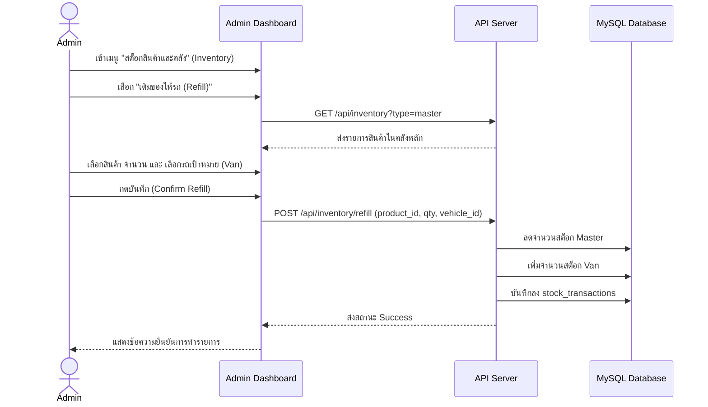
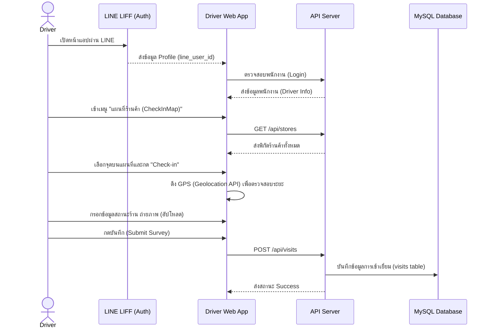
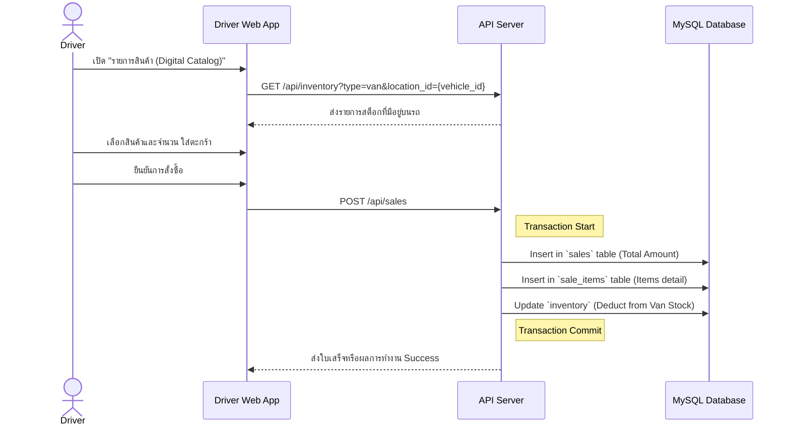
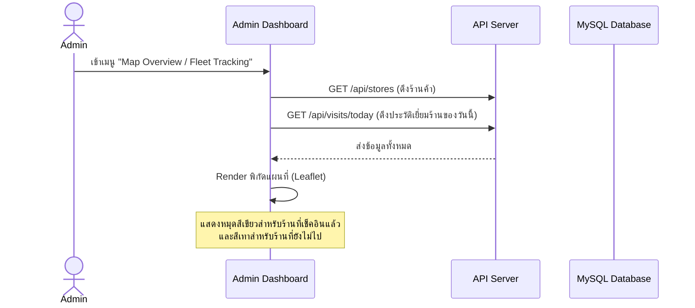

# กระบวนการทำงานของระบบ (System Workflows)

เอกสารส่วนนี้อธิบาย Flow การทำงานหลักๆ ของระบบ Wae Jer Logistic ตั้งแต่เริ่มวันทำงาน ไปจนถึงการเติมสต็อกและการตรวจสอบข้อมูลโดยแอดมิน

---

## 1. การเติมสต็อกเข้าสู่รถ (Van Refill Workflow)
ก่อนที่พนักงานขับรถจะออกเดินทาง แอดมินต้องทำการโอนย้ายสินค้าจากคลังหลัก (Master) เข้าสู่รถ (Van)

---

## 2. การลงพื้นที่และการสำรวจร้านค้า (Check-in & Survey Workflow)
กระบวนการที่พนักงานขับรถใช้เมื่อเดินทางไปถึงร้านค้าเป้าหมาย

---

## 3. การสร้างออเดอร์และการขายสินค้า (Sales Workflow)
เมื่อพนักงานอยู่หน้าร้านและทำการเสนอขายสินค้า

---

## 4. การดูภาพรวมและพิกัดพนักงาน (Fleet Tracking Workflow)
กระบวนการของแอดมินในการตรวจสอบพนักงานบนแผนที่

