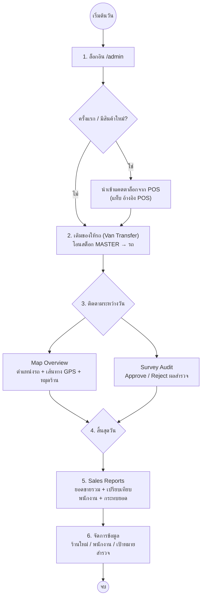

# กระบวนการทำงานของผู้ดูแลระบบ (Admin Workflow)

ลำดับขั้นตอนการทำงานในแต่ละวันของผู้ดูแลระบบ (Admin/Manager) ผ่านระบบ Wae Jer Logistic (Desktop Web)

## แผนผังกระบวนการ

---

## 1. เตรียมความพร้อมก่อนเริ่มงาน (Start of Day)

1. **ล็อกอิน** ที่ `/admin`
2. **นำเข้า/อัปเดตแคตตาล็อก (ถ้าจำเป็น):** เมนู คลังสินค้าและสินค้า → แท็บ "อ้างอิง POS" → กด "นำเข้าจาก POS" เพื่อดึงสินค้าจริงและสต็อกตั้งต้นจากระบบ POS (line-commerce)
3. **เติมของให้รถ (Van Transfer):**
   - แท็บ "คลังหลัก" หรือ "สต็อกรถ" → เลือกทำรายการเติมของ
   - เลือกคันรถเป้าหมาย (เช่น `V-01`) และจำนวนสินค้าแต่ละรายการ → ยืนยัน
   - ระบบตัดสต็อกจากคลังหลัก เพิ่มให้รถ และบันทึกลง `stock_transactions` (ประเภท TRANSFER)

---

## 2. ติดตามและตรวจสอบระหว่างวัน (During the Day)

1. **Fleet Tracking (Map Overview):**
   - ดูตำแหน่งรถของพนักงานแบบเรียลไทม์ (รีเฟรชอัตโนมัติทุก ~30 วินาที)
   - เลือกวันที่เพื่อดูเส้นทางการเดินทางย้อนหลัง (GPS Trail)
   - หมุดร้านเปลี่ยนเป็นสีเขียวเมื่อร้านถูกเยี่ยม/ขายสำเร็จ
2. **ตรวจสอบผลสำรวจ (Survey Audit):**
   - ตรวจรูปถ่ายและข้อมูลสถานะร้านที่พนักงานส่งมา
   - กด **Approve** (ตั้ง `verification_status = APPROVED`) หรือ **Reject** (คืน `status` เป็น UNSURVEYED)

---

## 3. สรุปยอดหลังจบวัน (End of Day)

1. **Sales Reports:**
   - ดูยอดขายรวมของวัน รายการบิล และรายละเอียดสินค้า/พื้นที่/พนักงาน
   - ดูตารางเปรียบเทียบผลงานพนักงาน (ยอดขาย/จำนวนร้าน)
   - เปรียบเทียบยอดในระบบกับเงินสด/สลิปที่พนักงานส่งมอบ — ลบบิลที่ผิดพลาดได้ (ระบบคืนสต็อกรถ)
2. **จัดการข้อมูล:**
   - ตรวจร้านใหม่ที่พนักงานเพิ่มเข้ามา
   - อัปเดตข้อมูลพนักงาน / รถ / ราคาสินค้า
   - เพิ่มหรือลบพื้นที่เป้าหมายสำรวจ (Survey Targets) สำหรับวันถัดไป

---

### สรุป Flow ของ Admin
`Login` ➔ `POS Import (ถ้าจำเป็น)` ➔ `Van Transfer` ➔ `Map Overview (ติดตามรถ + เส้นทาง)` ➔ `Survey Audit` ➔ `Sales Reports (กระทบยอด)` ➔ `จัดการข้อมูล`
