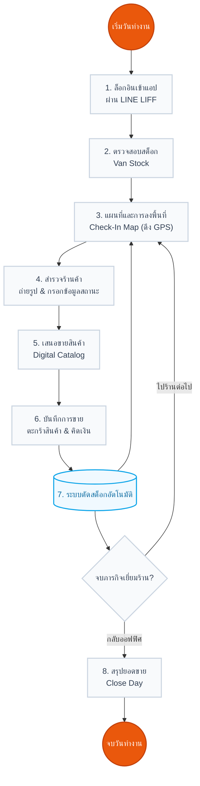

# กระบวนการทำงานของพนักงานขับรถ (Driver Workflow)

เอกสารนี้อธิบายลำดับขั้นตอนการทำงานในแต่ละวันของพนักงานขับรถหรือเซลส์หน่วยรถ (Cashvan / Driver) ผ่านแอปพลิเคชันบนมือถือ (Mobile Web Application)

## 📊 แผนผังกระบวนการทำงาน (Driver Workflow Diagram)

---

## 🌅 1. การเริ่มต้นวันทำงาน (Start of Day)

1. **ยืนยันตัวตน (Authentication):**
   - พนักงานเปิดใช้งานระบบผ่านแอปพลิเคชัน LINE (LINE LIFF)
   - ระบบจะผูกข้อมูลผู้ใช้กับ `line_user_id` ทันทีโดยไม่ต้องกรอกรหัสผ่าน
2. **รับมอบหมายงานและตรวจสอบสต็อก (Check Van Stock):**
   - พนักงานตรวจสอบสต็อกสินค้าที่อยู่ **บนรถของตนเอง (Van Stock)** ว่าตรงกับความเป็นจริงหรือไม่ ก่อนออกเดินทาง

---

## ☀️ 2. การลงพื้นที่และการขาย (During the Day)

กระบวนการนี้จะถูกทำซ้ำๆ ตามจำนวนร้านค้าที่ต้องไปเยี่ยมชมในแต่ละวัน

1. **ดูแผนที่และเดินทาง (Map Navigation):**
   - พนักงานเปิดเมนู **"แผนที่ร้านค้า (Check-In Map)"**
   - ดูพิกัดร้านที่ต้องไป และใช้แผนที่นำทางไปยังจุดหมาย
2. **เช็คอินและสำรวจร้านค้า (Check-in & Survey):**
   - เมื่อไปถึงร้าน พนักงานกดปุ่มเช็คอิน (ระบบจะดึงพิกัด GPS เพื่อยืนยันว่าถึงร้านจริง)
   - ถ่ายภาพหน้าร้านค้า หรือสภาพแวดล้อม
   - กรอกสถานะร้าน (เช่น ร้านเปิด, ร้านปิด, หรือร้านปฏิเสธการซื้อ) แล้วส่งข้อมูลเข้าส่วนกลาง
3. **เสนอขายสินค้า (Digital Catalog & Sales):**
   - หากร้านค้าต้องการสั่งซื้อสินค้า พนักงานจะเปิด **"รายการสินค้า (Catalog)"**
   - เลือกสินค้าและระบุจำนวนที่ลูกค้าต้องการ (ระบบจะอ้างอิงสต็อกบนรถแบบ Real-time)
   - กดยืนยันการสั่งซื้อ ระบบจะสรุปยอดเงิน (Total Amount) ให้ทราบ
4. **ตัดสต็อกอัตโนมัติ (Auto Stock Deduction):**
   - ทันทีที่บันทึกการขายสำเร็จ ระบบจะหักจำนวนสินค้าออกจากรถของพนักงานคันนั้นอัตโนมัติ

---

## 🌇 3. การสรุปยอดและจบงาน (End of Day)

เมื่อเดินทางครบทุกร้านและกำลังจะเลิกงาน

1. **ตรวจสอบประวัติการทำงาน (Visit History):**
   - พนักงานเข้าดูหน้าประวัติการเยี่ยมร้าน เพื่อตรวจสอบว่าไปเยี่ยมร้านไหนบ้าง และมียอดขายแต่ละร้านเท่าไหร่
2. **ปิดกะการทำงาน (Close Day):**
   - กดปุ่มสรุปยอดขาย (Close Day) เพื่อสรุปยอดเงินรวมทั้งหมดที่ได้รับมาในวันนั้น
   - นำเงินสดหรือสลิปการโอนเงิน ไปส่งมอบให้แอดมินหรือฝ่ายบัญชีที่ออฟฟิศ เพื่อทำการกระทบยอด (Reconcile)

---

### 📌 สรุป Flow ของ Driver
`LINE LIFF (Login)` ➔ `Check-In Map (หาพิกัดร้าน)` ➔ `Store Survey (ถ่ายรูปเช็คอิน)` ➔ `Digital Catalog (บันทึกการขาย)` ➔ `Close Day (สรุปยอดและส่งเงิน)`
