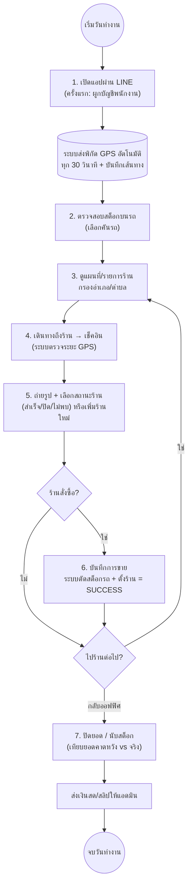

# กระบวนการทำงานของพนักงานขับรถ (Driver Workflow)

ลำดับขั้นตอนการทำงานในแต่ละวันของพนักงานขับรถ/เซลส์หน่วยรถ (Cashvan / Driver) ผ่าน Mobile Web App ในแอป LINE

## แผนผังกระบวนการ

---

## 1. เริ่มต้นวันทำงาน

1. **ยืนยันตัวตน:** เปิดแอปผ่าน LINE — ระบบล็อกอินอัตโนมัติด้วยบัญชี LINE
   - ครั้งแรกต้องเลือกชื่อพนักงานจากรายการเพื่อ **ผูกบัญชี** (`bind`) — ทำครั้งเดียว
2. **ระบบเริ่มติดตามตำแหน่ง:** ขณะล็อกอิน ระบบส่งพิกัดปัจจุบันให้ส่วนกลางทุก 30 วินาที และบันทึกจุดเส้นทาง (GPS Trail) ของวันนี้
3. **ตรวจสอบสต็อกบนรถ:** เลือกคันรถของตนเอง แล้วตรวจว่าจำนวนสินค้าในระบบตรงกับของจริงบนรถ

---

## 2. ลงพื้นที่และการขาย (ทำซ้ำตามจำนวนร้าน)

1. **ดูแผนที่/รายการร้าน:** เปิดหน้าแผนที่หรือรายการร้าน กรองตามอำเภอ/ตำบล ดูว่ายังเหลือร้านไหนที่ต้องไป
2. **เช็คอิน:** เมื่อถึงร้าน เลือกร้านนั้น — ระบบดึง GPS ปัจจุบันและตรวจระยะห่างจากพิกัดร้าน
3. **สำรวจร้าน:** ถ่ายรูปหน้าร้าน (อัปโหลดขึ้นคลาวด์), เลือกสถานะ (สำเร็จ / ร้านปิด / ไม่พบร้าน), กรอกหมายเหตุ → ยืนยัน
   - เจอร้านใหม่: กด "เพิ่มร้าน" ปักหมุด กรอกชื่อ/อำเภอ/ตำบล/ประเภท/เบอร์โทร (ร้านใหม่รอแอดมินตรวจสอบ)
4. **บันทึกการขาย (ถ้ามีออเดอร์):** เลือกสินค้าและจำนวน → ระบบคิดยอดรวม → ยืนยัน
   - ระบบตัดสต็อกบนรถทันที และตั้งสถานะร้านเป็น "สำเร็จ"

---

## 3. สรุปยอดและจบงาน

1. **ตรวจประวัติการเยี่ยม:** ดูว่าวันนี้ไปร้านไหนมาบ้างและยอดขายแต่ละร้าน
2. **ปิดยอด (Close Day):** กรอกจำนวนสินค้าที่เหลือจริงบนรถ — ระบบเทียบกับยอดที่ควรเหลือและแสดงผลต่างรายสินค้า → ยืนยัน (ระบบล้างสต็อก VAN)
3. **ส่งมอบเงิน:** นำเงินสด/สลิปโอนไปส่งให้แอดมินหรือฝ่ายบัญชีเพื่อกระทบยอด

---

### สรุป Flow ของ Driver
`LINE Login (+ bind ครั้งแรก)` ➔ `GPS อัตโนมัติ` ➔ `ตรวจสต็อกรถ` ➔ `แผนที่/รายการร้าน` ➔ `เช็คอิน + สำรวจ (ตรวจระยะ GPS + รูป)` ➔ `บันทึกการขาย (ตัดสต็อก)` ➔ `ปิดยอด/นับสต็อก` ➔ `ส่งเงิน`
